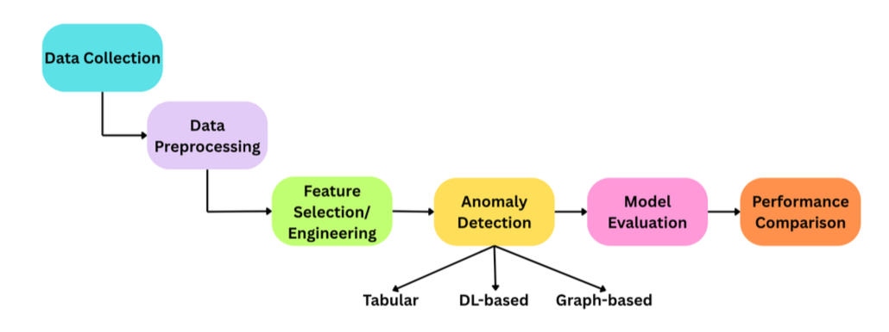
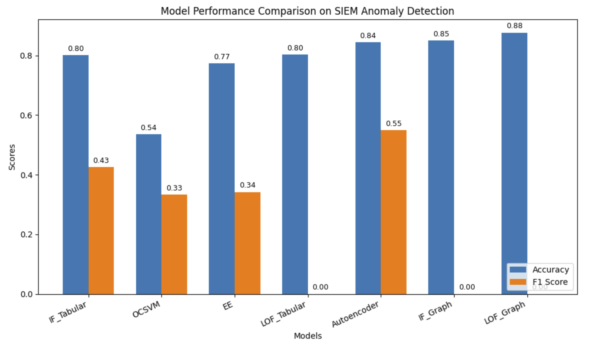
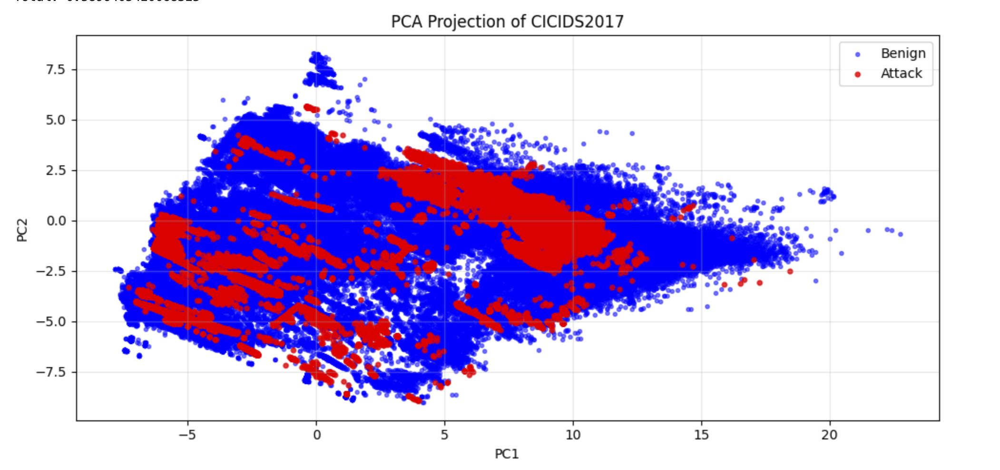
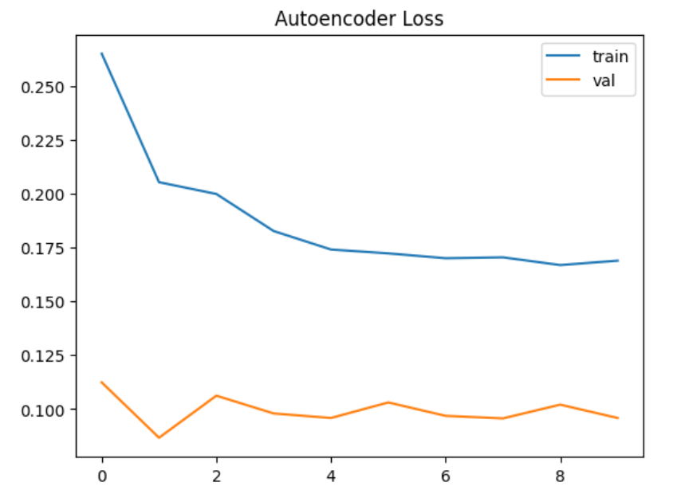
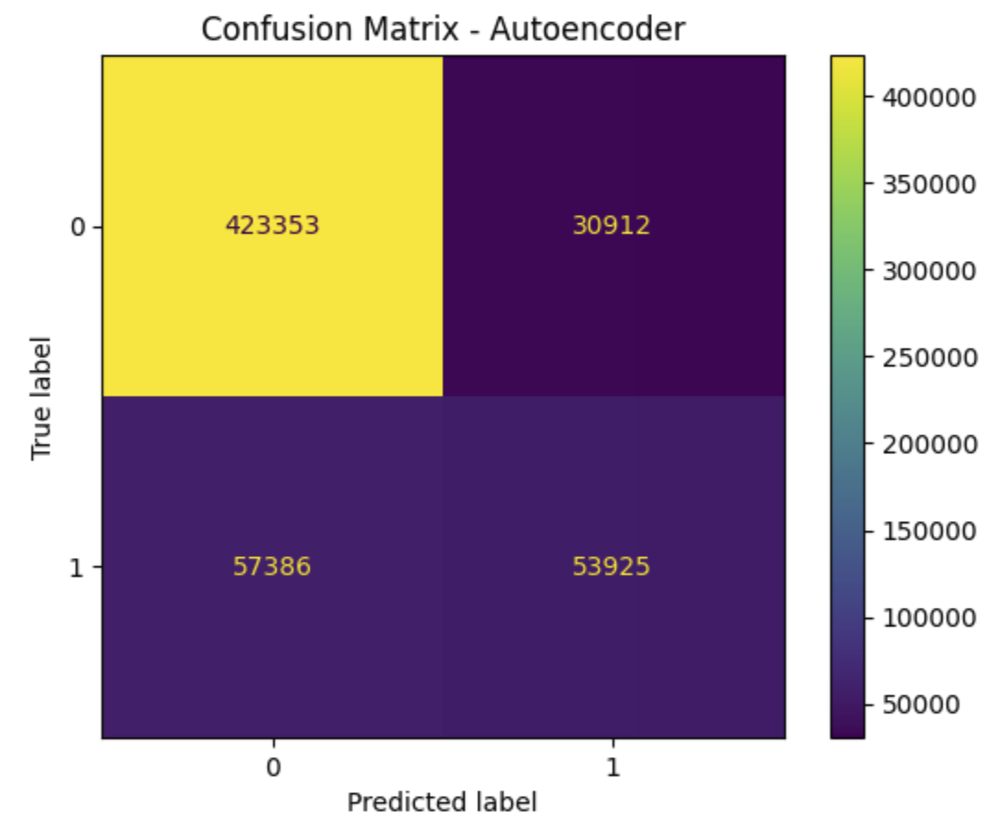

# Comparative Analysis of Tabular, Deep Learning, and Graph-Based Anomaly Detection Techniques for SIEM Data

A comparative study of tabular, deep learning, and graph-based anomaly detection techniques for Security Information and Event Management (SIEM) data. This project evaluates multiple approaches for detecting anomalous security events and compares their effectiveness using standard classification metrics.

---

## Workflow



---

## Overview

Security Information and Event Management (SIEM) systems generate large volumes of network and security logs that require automated anomaly detection to identify potential cyber threats. This project presents a comparative analysis of traditional machine learning, deep learning, and graph-based anomaly detection techniques using the **CICIDS2017** dataset for SIEM-inspired anomaly detection.

The study evaluates the effectiveness of different approaches in detecting anomalous network traffic and highlights their strengths and limitations using standard classification metrics and visual analysis.

---

## Dataset

**Dataset:** `CICIDS2017 (Canadian Institute for Cybersecurity Intrusion Detection System 2017)`

**Task:** `Binary Anomaly Detection`

The project uses the **CICIDS2017** dataset, a widely used benchmark for intrusion detection and cybersecurity research. The dataset contains network traffic records representing both benign activity and multiple categories of cyber attacks.

For this study, the data was preprocessed through feature selection, label encoding, normalization, and train-test splitting before applying anomaly detection models.

---

## Methods Evaluated

The project compares the following anomaly detection techniques:

- Isolation Forest (Tabular)
- One-Class SVM
- Elliptic Envelope
- Local Outlier Factor (Tabular)
- Autoencoder (Deep Learning)
- Isolation Forest (Graph-Based)
- Local Outlier Factor (Graph-Based)

---

## Tech Stack

- Python
- Jupyter Notebook
- NumPy
- Pandas
- Scikit-learn
- TensorFlow / Keras
- NetworkX
- Matplotlib
- Seaborn

---

## How to Run

1. Clone the repository.

```bash
git clone https://github.com/anjaleeeeeee/siem-anomaly-detection-comparative-study.git
```

2. Install the required dependencies.

```bash
pip install -r requirements.txt
```

3. Open `siem_anomaly_detection_comparative_study.ipynb` in Jupyter Notebook or JupyterLab.

4. Run all cells sequentially.

---

## Results

The models were evaluated using **Accuracy, Precision, Recall, and F1-Score** to compare the effectiveness of tabular, deep learning, and graph-based anomaly detection techniques on SIEM security event data.

| Model | Accuracy | Precision | Recall | F1-Score |
|--------|---------:|----------:|-------:|---------:|
| Isolation Forest (Tabular) | 0.801 | 0.493 | 0.375 | 0.426 |
| One-Class SVM | 0.536 | 0.232 | **0.588** | 0.333 |
| Elliptic Envelope | 0.774 | 0.400 | 0.299 | 0.342 |
| Local Outlier Factor (Tabular) | 0.803 | 0.000 | 0.000 | 0.000 |
| Autoencoder | 0.844 | **0.636** | 0.484 | **0.550** |
| Isolation Forest (Graph-Based) | 0.850 | 0.000 | 0.000 | 0.000 |
| Local Outlier Factor (Graph-Based) | **0.877** | 0.000 | 0.000 | 0.000 |

### Performance Comparison



The comparative analysis highlights the strengths and limitations of different anomaly detection approaches for SIEM security event data. While **Local Outlier Factor (Graph-Based)** achieved the highest overall accuracy (**0.877**), it failed to identify anomalous events effectively, resulting in zero Precision, Recall, and F1-Score. In contrast, the **Autoencoder** provided the best balance between anomaly detection capability and overall performance, achieving the highest Precision (**0.636**) and F1-Score (**0.550**), making it the most effective model in this comparative study.

---

## PCA Visualization

The PCA projection illustrates the distribution of normal and anomalous events in a reduced two-dimensional feature space, providing insight into the separability of the data.



---

## Autoencoder Training Loss

The training and validation loss curves demonstrate the convergence of the autoencoder during training, indicating stable learning behavior and helping assess potential overfitting.



---

## Confusion Matrix

The confusion matrix of the best-performing model provides a detailed view of prediction outcomes, highlighting true positives, false positives, true negatives, and false negatives.



---

## Publication

This repository contains the implementation and experiments supporting the MSc thesis:

**"Comparative Analysis of Tabular, Deep Learning, and Graph-Based Anomaly Detection Techniques for SIEM Data"**

Completed as part of the **MSc Data Science** program (2026).

---

## Future Work

- Evaluate Graph Neural Networks (GNNs) for anomaly detection.
- Explore transformer-based architectures for security log analysis.
- Deploy the anomaly detection pipeline for real-time SIEM monitoring.
- Extend the framework to larger enterprise security datasets.

---

## Acknowledgements

This project was developed using the following open-source libraries and frameworks:

- TensorFlow / Keras
- Scikit-learn
- NetworkX
- NumPy
- Pandas
- Matplotlib
- Seaborn

---

## License

This project is licensed under the MIT License.
